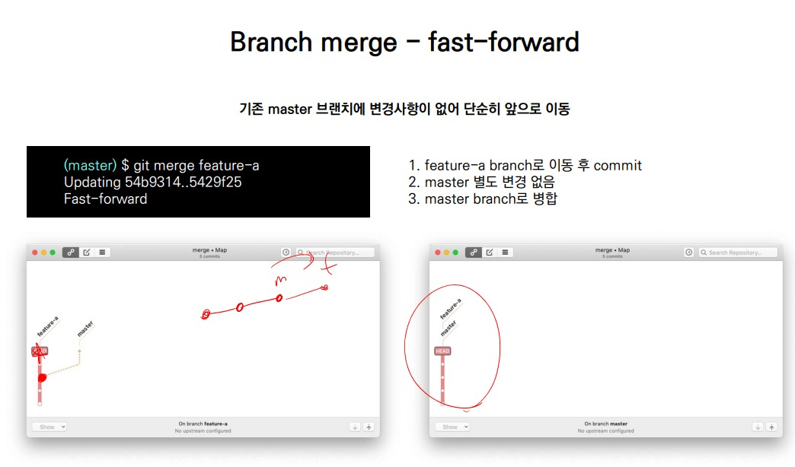
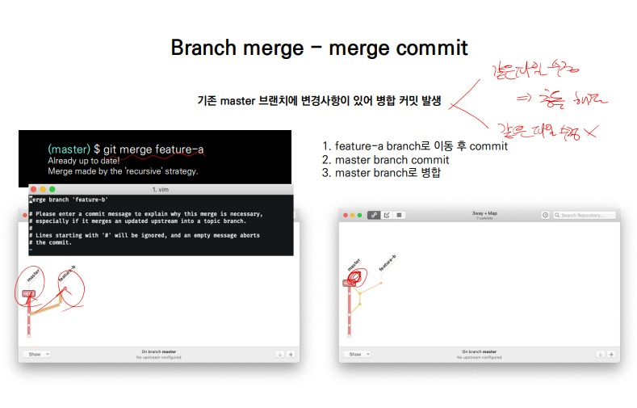

## **❗`clone 주의` ❗**

- 클론하면 원격 저장소의 이름 생성됨

- clone해서 가져온 폴더에서 작업해야함.

❗**압축폴더 -> 최신버전의 파일/폴더**

**❗clone-> git 저장소를 가져온것.**

## pull 과 clone의 차이

- pull - 커밋 (수정된것만)

- clone - 현 상태 백업

##  											Git Flow

|            branch             |                          주요 특징                           |                      예시                       |
| :---------------------------: | :----------------------------------------------------------: | :---------------------------------------------: |
|         master (main)         |                   -배포 가능한 상태의 코드                   |      LOL 클라이언트 라이브 버전 (9.23.23)       |
|        develop (main)         | -feature branch로 나뉘어지거나, 발생된 버그 수정 등 개발진행 .  -개발이후 release branch로 갈라짐 |           다음 패치를 위한 개발(9.24)           |
| feature branches (supporting) | -기능별 개발 브랜치(topic branch)  -기능이 반영되거나 드랍되는 경우 브랜치 삭제 | 개발시 기능별 예) 신규챔피언, 오브젝트 업데이트 |
| release branches (supporting) | -개발 완료 후 QA/Test 등을 통해 얻어진 다음 배포 전 monior bug fix 등 반영 |                   9.24a,b,c..                   |
|     hotfixes (supporting)     | -긴급하게 반영해야하는 bug fix -release branch는 현재 버전을 위한 것 |                    긴급 패치                    |

##  							Branch basic commands

1. 브랜치 생성 - $ git branch {브랜치 이름}
2. 브랜치 이동 - $ git checkout {브랜치 이름}
3. 브랜치 생성 및 이동 - $git check out -b {브랜치 이름}
4. 브랜치 목록 - $ git branch
5. 브랜치 삭제 - $ git branch -d {브랜치 이름}

## 									Branch Merge

 각 branch에서 작업을 한 이후 이력을 합치기 위해서는 일반적으로 merge 명령어를 사용

병합을 진행할 때, 만약 서로 다른 커밋/버전에서 동일한 파일을 수정한 경우 충돌이 발생할 수 있다. 

이 경우에는 반드시 직접 수정을 진행  . 충돌이 발생한 것은 오류가 발생한 것이 아니라 이력이 변경되는 과정에서 발생할 수 있다.

